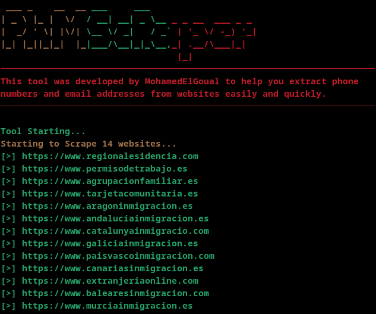

# PhmScRaper 🕷️

<div align="center">


**🚀 Advanced Multi-Threaded Web Scraper for Contact Information Extraction By MohamedGoual**

</div>

## 🎯 Overview

PhmScRaper is a powerful, multi-threaded web scraping tool designed to extract contact information (emails and phone numbers) from websites efficiently. Built with Python, it combines advanced pattern matching, concurrent processing, and intelligent filtering to deliver fast and accurate results.

### 🌟 Why Choose PhmScRaper?

- **🔥 Lightning Fast**: Multi-threaded architecture with configurable workers
- **🎯 Intelligent Extraction**: Advanced regex patterns for emails and phone numbers
- **🌐 Global Support**: Recognizes international phone number formats
- **📊 Multiple Export Formats**: TXT, CSV, JSON, and combined formats
- **🛡️ Smart Filtering**: Automatically filters out invalid numbers and spam patterns
- **🔄 Deep Crawling**: Configurable depth website crawling
- **📱 Modern Interface**: Beautiful colored terminal output with progress tracking

## ⚡ Key Features

### 🎨 Advanced Pattern Recognition
- **Email Detection**: Multiple regex patterns including obfuscated emails (`[at]`, `[dot]`)
- **Phone Number Validation**: International formats with smart filtering
- **Invalid Pattern Filtering**: Automatically excludes timestamps, dates, and spam numbers

### 🚀 High-Performance Architecture
- **Multi-Threading**: Configurable concurrent workers (default: 10)
- **Session Management**: Persistent HTTP sessions for better performance
- **Request Optimization**: Smart timeout and delay management
- **Memory Efficient**: Optimized data structures and processing

### 🌍 Global Phone Number Support
- **US/Canada**: `+1`, `(xxx) xxx-xxxx`, `xxx-xxx-xxxx`
- **UK**: `+44 7xxx xxxxxx`
- **Germany**: `+49 1xx xxxxxxxx`
- **Brazil**: `+55 xx 9xxxx-xxxx`
- **India**: `+91 xxxxx xxxxx`
- **China**: `+86 1xx xxxx xxxx`
- **Middle East**: `+96x`, `+2xx` formats
- **And many more international formats**

### 🎛️ Flexible Configuration
- **Crawling Depth**: Configure how deep to crawl websites
- **Worker Threads**: Adjust concurrent processing power
- **Request Delays**: Control scraping speed and server load
- **Timeout Settings**: Customize request timeout values
- **File Filtering**: Smart exclusion of non-relevant file types

### 📊 Multiple Export Options
- **TXT Files**: Clean, line-separated lists
- **CSV Format**: Structured data with source tracking
- **JSON Export**: Detailed results with metadata
- **Combined Reports**: All formats in organized directories

## 🔧 Installation

### Prerequisites
```bash
python >= 3.7
```

### Quick Install
```bash
git clone https://github.com/MohamedGoual/PhmScRaper
```
```bash
cd PhmScRaper
```
```bash
bash setup.bash
```

## 🚀 Usage
### Command Line Mode
```bash
python PhmScRaper.py -u https://example.com -o results
```

#### Multiple URLs
```bash
python PhmScRaper.py -u https://site1.com https://site2.com https://site3.com -o my_results
```

#### From File
```bash
python PhmScRaper.py -f urls.txt -o batch_results
```

#### Advanced Configuration
```bash
python PhmScRaper.py -f urls.txt -w 20 -t 45 -d 0.5 --depth 3 --export json -o advanced_results
```

## 📝 Command Line Arguments

| Argument | Short | Description | Default | Example |
|----------|-------|-------------|---------|---------|
| `--urls` | `-u` | URLs to scrape | None | `-u site1.com site2.com` |
| `--file` | `-f` | File with URLs | None | `-f urls.txt` |
| `--workers` | `-w` | Max concurrent workers | 10 | `-w 20` |
| `--timeout` | `-t` | Request timeout (seconds) | 30 | `-t 45` |
| `--delay` | `-d` | Delay between requests | 1.0 | `-d 0.5` |
| `--depth` | | Crawling depth | 2 | `--depth 3` |
| `--export` | | Export format | all | `--export json` |
| `--output` | `-o` | Output directory | Required | `-o results` |
| `--quiet` | | Quiet mode | False | `--quiet` |

## 📁 Output Formats

### TXT Format
```
emails.txt          # Clean email list
phones.txt          # Clean phone number list
```

### CSV Format
```csv
Type,Value,Source_URLs
Email,contact@example.com,https://example.com; https://example.com/contact
Phone,+1-555-123-4567,https://example.com/contact
```

### JSON Format
```json
{
  "scraping_timestamp": "2024-01-15T10:30:00",
  "total_websites": 5,
  "successful_scrapes": 4,
  "results": [
    {
      "url": "https://example.com",
      "status": "Success",
      "response_time": 1.23,
      "emails": ["contact@example.com"],
      "phones": ["+1-555-123-4567"],
      "error_message": ""
    }
  ]
}
```

## 💡 Examples

### Basic Usage Examples

#### 1. Quick Single Site Scan
```bash
python PhmScRaper.py -u example.com -o quick_scan
```

#### 2. Bulk URL Processing
Create `urls.txt`:
```
https://company1.com
https://company2.com
https://company3.com
```

Run scraper:
```bash
python PhmScRaper.py -f urls.txt -o bulk_results
```

#### 3. High-Performance Scraping
```bash
python PhmScRaper.py -f large_urls.txt -w 50 -t 20 -d 0.2 --depth 4 -o high_perf_results
```

### URL File Format
```txt
# This is a comment - lines starting with # are ignored
https://example.com
http://another-site.com
subdomain.example.org

# You can add comments anywhere
https://final-site.com
```

## ⚙️ Configuration

### Performance Tuning

#### For Fast Scraping (High-End Systems)
```bash
-w 50 -t 15 -d 0.1 --depth 4
```

#### For Respectful Scraping (Recommended)
```bash
-w 10 -t 30 -d 1.0 --depth 2
```

#### For Slow/Unstable Networks
```bash
-w 5 -t 60 -d 2.0 --depth 1
```

### File Type Filtering

The scraper automatically ignores these file types:
- **Stylesheets**: `.css`
- **Scripts**: `.js`
- **Documents**: `.pdf`, `.doc`, `.docx`, `.xls`, `.xlsx`, `.ppt`, `.pptx`
- **Images**: `.png`, `.jpg`, `.jpeg`, `.gif`, `.svg`, `.ico`
- **Fonts**: `.woff`, `.woff2`, `.ttf`, `.eot`
- **Archives**: `.zip`, `.rar`, `.tar`, `.gz`
- **Media**: `.mp4`, `.mp3`, `.avi`, `.mov`

## 📈 Performance

### Benchmarks

| Websites | Workers | Avg Time | Emails Found | Phones Found |
|----------|---------|----------|--------------|--------------|
| 10 sites | 10 workers | 45s | 127 | 89 |
| 50 sites | 20 workers | 3m 12s | 634 | 445 |
| 100 sites | 30 workers | 5m 47s | 1,248 | 892 |

### Memory Usage
- **Base Memory**: ~50MB
- **Per Worker**: ~5-10MB
- **Per Website**: ~1-3MB (cached)

## 🛡️ Security Features

### Smart Pattern Filtering
- **Spam Prevention**: Filters repeated digits and obvious fake numbers
- **Date Exclusion**: Ignores timestamps and date formats
- **IP Address Filtering**: Excludes IP addresses from phone results
- **File Extension Validation**: Prevents processing binary files

### Request Safety
- **User-Agent Rotation**: Mimics real browser requests
- **Rate Limiting**: Configurable delays prevent server overload
- **Timeout Protection**: Prevents hanging on slow servers
- **Session Management**: Efficient connection reuse

## 🎨 Visual Features

### Colorful Terminal Output
- **🟢 Green**: Successful operations and found data
- **🔴 Red**: Errors and warnings
- **🟡 Yellow**: Progress information
- **🟣 Magenta**: Website URLs
- **⚪ White**: General information

### ASCII Art Banner
The tool features a custom ASCII art banner with gradient coloring for a professional appearance.

### Progress Tracking
Real-time display of:
- Currently processing URL
- Success/failure status
- Response times
- Found contact counts

## 🔄 Advanced Features

### Intelligent URL Processing
- **Auto-Protocol Detection**: Adds `https://` if missing
- **Relative Link Resolution**: Converts relative links to absolute
- **Same-Domain Filtering**: Only follows links within the target domain
- **Duplicate Prevention**: Avoids processing the same URL twice

### Content-Type Validation
- Only processes HTML content
- Skips binary files and media
- Validates response headers

### Error Handling
- **Graceful Degradation**: Continues on individual failures
- **Detailed Error Reporting**: Specific error messages for troubleshooting
- **Recovery Mechanisms**: Retries and fallbacks for network issues

## 🤝 Contributing

We welcome contributions! Here's how you can help:

### Ways to Contribute
- 🐛 **Bug Reports**: Found an issue? Let us know!
- ✨ **Feature Requests**: Have an idea? We'd love to hear it!
- 🔧 **Code Contributions**: Submit pull requests
- 📖 **Documentation**: Improve our docs
- 🌐 **Translations**: Help us go global

### Coding Standards
- Follow PEP 8 style guidelines
- Add type hints where applicable
- Include docstrings for new functions
- Write tests for new features

## 📄 License

This project is licensed under the MIT License - see the [LICENSE](LICENSE) file for details.
*Discussions**: [GitHub Discussions](https://github.com/E7ATxT0r/E7PhMScRaper/discussions)

### Contact
- **Developer**: MohamedElGoual
- **Email**: [MohamedElGoual@proton.me]
- **GitHub**: [@MohamedElGoual]

---

<div align="center">

**⭐ If you found this tool useful, please give it a star! ⭐**

Made with ❤️ by MohamedElGoual

</div>
